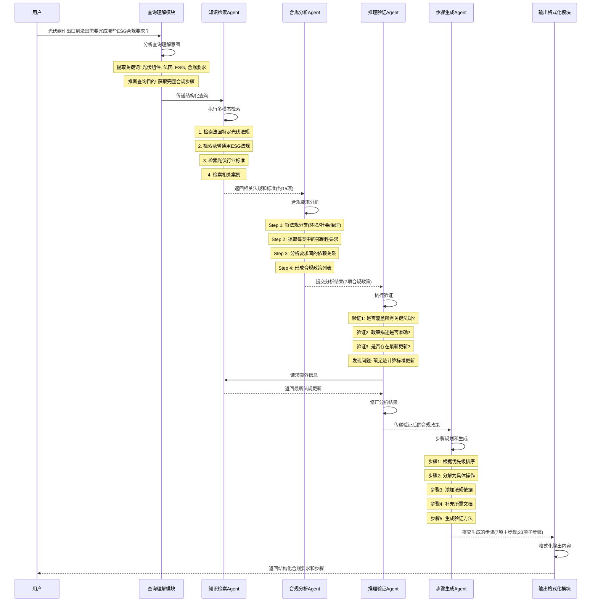
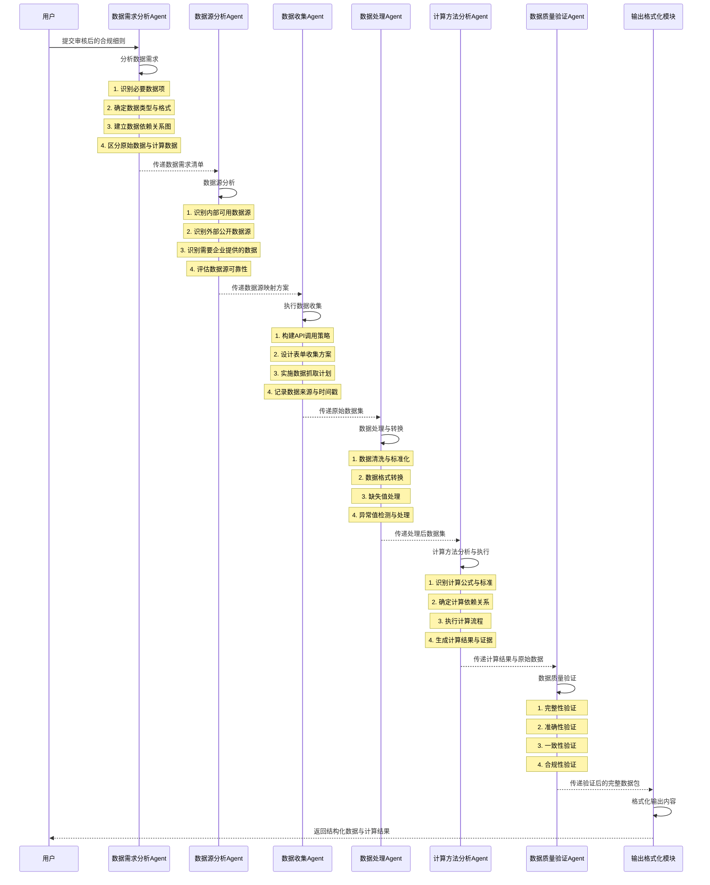
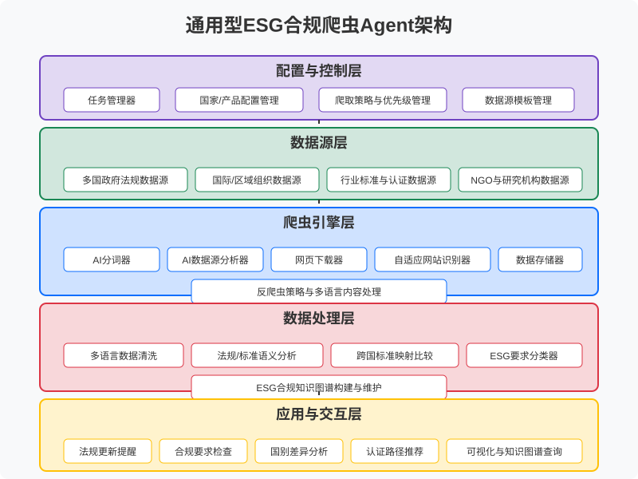

## 1. 概要
光伏组件出口到法国ESG合规要求agent
## 2. 核心流程
 ### 2.1 政策法规收集-不限方式
    获取光伏组件出口法国的必须政策文件
 ### 2.2 构建知识库
    目标：将收集到的政策法规整理成结构化的知识库，便于查询和使用。
    实现方法：
        文本处理：多类型文档解析。
        分类整理：利用主题建模技术（如LDA），按照ESG三大维度（环境、社会、治理）对政策进行分类。
        结构设计：构建知识图谱，连接政策文本、关键词和主题，提高检索效率。
        
    知识库结构示例：
        政策文本：完整法规内容或摘要
        关键词：光伏、ESG、合规、法国、欧盟
        知识图谱：
        主题分类：
            环境：碳足迹、废弃物管理
            社会：供应链责任
            治理：信息披露要求
### 2.3 合规步骤生成agent
    目标：生成光伏组件出口到法国的具体合规步骤以及步骤依据。
         生成每个步骤所需要都具体内容细则以及细则依据。

### 2.4 步骤以及细则审核
    考虑到AI的幻觉以及所属业务为付费产品的原因，本着对结果负责的宗旨需要对生成的步骤以及细则进行审核。
    用户看到的均为审核后的数据
### 2.5 根据审核后的细则收集完成细则所需要的数据收集与计算agent

    
### 2.6 数据完整性验证与审核

### 2.7 整合最终方案形成报告等

## 3. 子流程

### 3.1 自动化爬虫
     自动化爬虫获取相关政策法规数据
     详见：大模型辅助构建 ESG 合规知识库设计理念与使用说明.docx
 

## 4. 实施步骤
 ### 4.1 方案一:  知识库 --> 合规步骤生成agent -->自动化爬虫
     先使用现有爬虫、手动等方式获取光伏组件出口法国的必须政策文件
     基于文件完成核心流程的研究与开发。
     基于核心流程以及公司客户主要业务目标完成初始版本交付

 目标:先完成核心流程保证有一个可用的产品，然后完善子流程及优化
 好处：只要核心流程完成即可交付初始版本以供其他团队使用，
      可避免若核心流程未完成，那么爬虫设计的再好也不能交付或者爬虫流程未完成则无任何可交付物的风险，
      积累所需爬取数据的初步流程与方法

### 4.2 方案二: 自动化爬虫 -->  知识库 --> 合规步骤生成agent
风险:周期长，若爬虫未完成则无任何可交付物